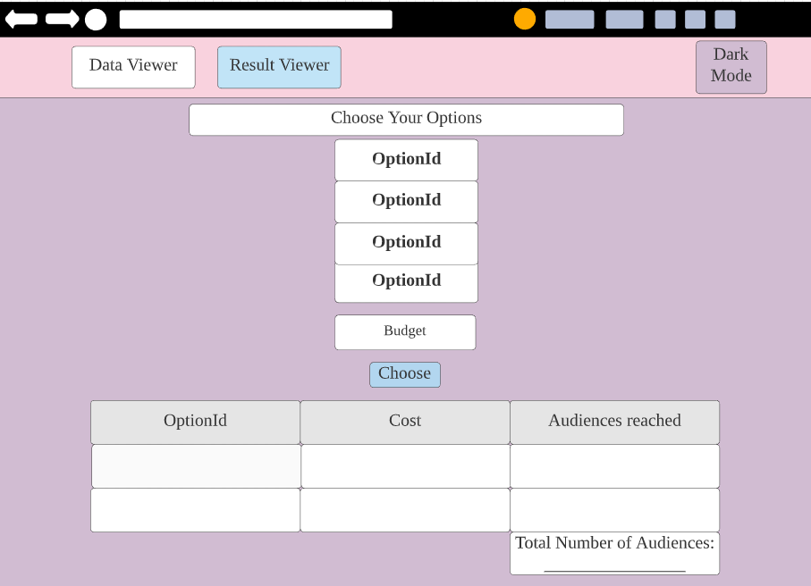
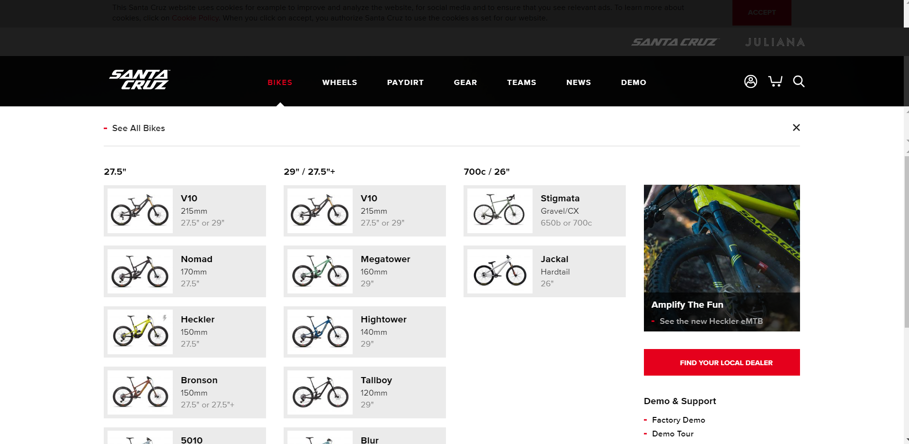

# Wireframe & Justification

This document should help you explain how your user interfaces are designed. You should have a wireframe to give a good overview and some screenshot with simple writeups to justify your designs.

## Wireframe

> This is just an example, please find your own wireframe.

## Justifications

### Justification 1

#### Good Points

1. Nice looking UI.
2. Shows the best options using contrasting colours to make it stand out.

#### Bad Points

1. Uses different algorithm so there are irrelevent things on the webpage.
2. May be hard to implement.

### Justification 2

#### Good Points

1. Shows appropriate data in a table.

#### Bad Points

1. Uses different algorithm so there are irrelevent things on the webpage.
2. Bad looking UI.

### Justification 3

#### Good Points

1. Allows users to input approriate data into a table.
2. Able to easily understand and use the website.

#### Bad Points

1. UI looks outdated.
2. Colours do not look pleasing.
